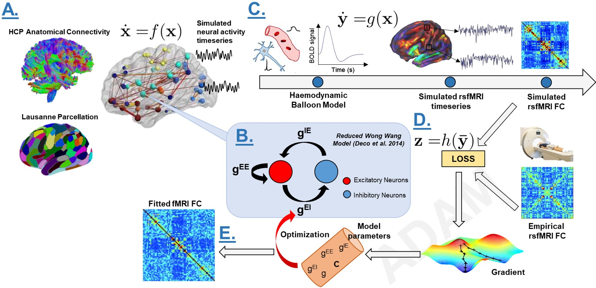
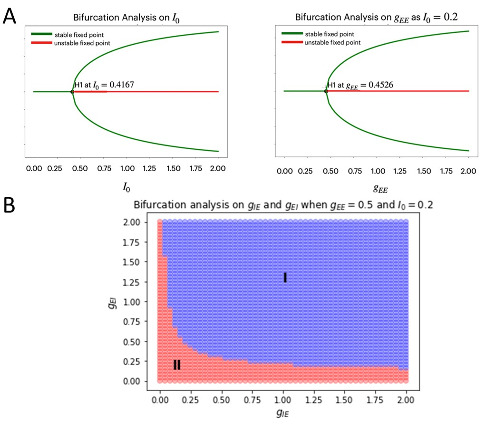
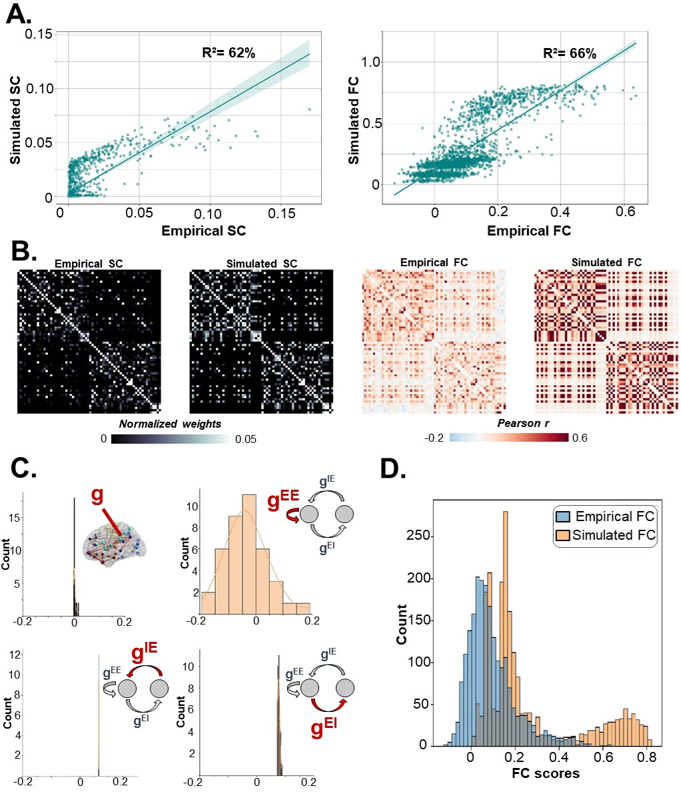
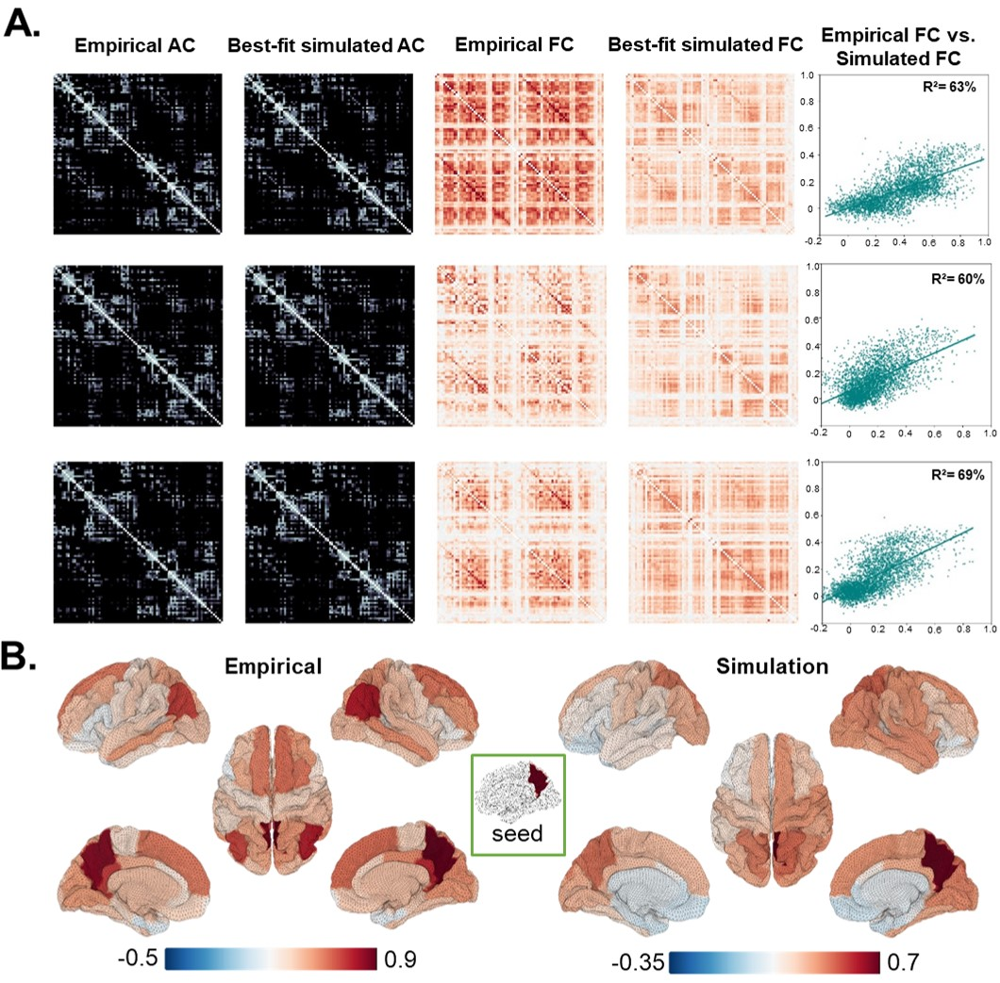

# Deep Learning-Based Parameter Estimation for Neurophysiological Models of Neuroimaging Data

This repository contains the code for the manuscript Griffiths, Wang, Ather, Momi, Rich, Diaconescu, McIntosh, & Shen (2022) "Deep Learning-Based Parameter Estimation for Neurophysiological Models of Neuroimaging Data". Using the two-dimensional reduced Wong-Wang equations introduced by Deco and colleagues, one may simulate the connectivity of the brain structure and plot the connectivity weights. Here, we extend these methods to include the use of a loss function to minimize the the difference of the surprise, the entropy, and the prior. It optimizes the hyperparameters that serve as the coefficients for the coupling strengths with the ADAM algorithm. As the emerging computational neuroscience paradigm for modelling large-scale network dynamics in whole-brain modelling, CNMMs allow for estimation of physiological parameters by fitting them to empirical data from activity measured through fMRI and M/EEG sources.



Modelling methodology overview: The process of modelling and model-fitting begins by taking the input fMRI data and using a loss function to minimize the the difference of the surprise, the entropy, and the prior. It optimizes the hyperparameters that serve as the coefficients for the coupling strengths using the ADAM algorithm. 

The notebooks contained in this repository have the can be used for each step of the process. Training of the network proceeds on the basis of this input/output mapping. By inputting fMRI noise into the model and simulating the resulting BOLD signal, one can train the global coupling strength parameters to measure the strength of the connection gains to determine which parameters fit best. Using this approach, one can demonstrate the robust recovery of parameters in synthetic data, and then apply the framework to modelling of empirical resting-state fMRI data from the Human Connectome Project database. The model uses an empirical BOLD signal as an output reference. Future work could explore how a generalization to other models of neural dynamics could also be used understand how feasible CNMMs can be applied to different neuronal systems, to task-evoked activity, and to other non-fMRI measurement types. 

## Reduced Wong-Wang (Dynamic Mean Field) model

The computational model of resting-state network dynamics, the dynamic mean field model, was previously introduced in Deco et al., 2013. The dynamic mean field approach involves approximating the average behaviour of an ensemble of neurons, instead of modeling interactions of individual neurons. This mean field model is a reduction of the model presented in Wong & Wang, 2006 to a single population model, and is used in modeling studies of resting-state (Deco et al., 2013; Hansen et al., 2015). The neural activity of each node is given by the following equations:

<p align="center">

</p>

<p align="center">

</p>

<p align="center">

</p>

<p><div style="text-align: justify"><font size="4.5" face="calibri">Below is a summary of the model parameters:</font></div></p>  

| Symbol | Name | Unit | Nominal value | Description
| :------------- |:-------------| :-------------| :-------------| :-------------| 
|  | Average synaptic gating variable at the local area  | n/a | n/a | Accounts for the fractions of open channels of neurons |
|  | Sigmoid function  | n/a | n/a | Converts the input synaptic activity  into an output population firing rate |
| |  Parameters of the input-output function  |   | (E) 310, (I) 615 | Used in optimization when fitting the model |
| |  Parameters of the input-output function  | kHz | (E) 125, (I) 177 | Optimize this parameter when fitting the model |
| |  Parameters of the input-output function  | ms | (E) 0.16, (I) 0.087 | Optimize this parameter when fitting the model |
| |  Local excitatory recurrence | n/a | 1.0 | NMDA-mediated local recurrent excitation scales the external input |
|  | Kinetic parameter | ms | (E) 0.641, (I) 1| Account for the second-order kinetics |
|  | Time constant of decay | ms | 0.65 | Time decay rate constant for NMDA and GABA receptors |
|   | Synaptic couplings | nA | 0.2609 | Account for the coupling interaction between synapses | 
|  | Overall effective external input | nA | 0.3 | External current input to the model |  
|  | Entries of the anatomical SC matrix | n/a | Various | Connectivity strengths defined by the neuroanatomical connections between those brain areas in the human | 
|  | Global scaling coupling (reweighs the SC) | n/a | n/a | Reweigh the structural connectivity weights into to let them account for global interactions | 
|  | Amplitude of the uncorrelated Gaussian white noise | nA | 0.01 | Add a factor of white noise when simultaing the signal 
|  | Standard deviation of Gaussian white noise | n/a | 0.02 | Multiply the standard deviation to the white noise 

## Balloon-Windkessel model

<p align="center">

</p>

<p align="center">

</p>

<p align="center">

</p>

<p align="center">

</p>

The transformation of the state variable of the neural mass model into a quantity that can be compared to the experimental BOLD signal obtained by fMRI can be modelled using a forward model function. Following Deco et al. 2014, for this we use the Balloon-Windkessel model (Friston et al., 2000), which captures much of the known biophysics of BOLD signal generation. In the case of the Balloon-Windkessel model, in which the vascular bed in a small volume of tissue is modelled as an expandable venous compartment fed by the output of the capillary bed, the volume flow rate (ml/s) into the tissue, , is an assumed function of time that drives the system. Blood volume changes happen primarily in the venous compartment. This can be used in modelling the transient aspects of the BOLD signal using the output function described (Friston et al., 2000). This input-state-output model can use the BOLD signal equation with a nonlinear function of normalized venous volume (), normalized total deoxyhemoglobin voxel content (), and resting net oxygen extraction fraction by the capillary bed (). 


## Installation

Required packages are in the `requirements.txt`. Install them!

```
pip install -r requirements.txt
```

## Running the notebooks

Notebooks for running the model fitting analyses and analyzing+visualizing results can be found in the `notebooks` directory. Use the input data of connectivity to initialize the states (E, I, x, f, v, q) as random arrays, measure connection gain initial values (empirical SC). The initial values on the global and local gains are fixed constnats. The ADAM fitting algorithm is used with the auto gradient calculation for fitting.

## Contents

The figures from the manuscript "Deep Learning-Based Parameter Estimation for Neurophysiological Models of Neuroimaging Data" can be reproduced in the following notebooks.

### Figure 2: Bifurcation analysis




The bifurcation analysis results show the dynamics of the WWD model that change as different parameters are tested. The dynamics of the single node network are shown using the eigenvalues that can be used to represent stability. 

Code source: [Bifurcation notebook](../main/scratch/bifurcationanalysis_singleNode_wwd.ipynb).


### Figure 3: Synthetic data model-fitting analysis




The model-fitting analysis on synthetic data (from Hagmann et al., 2008) show the model's ability to recover known parameters. 

Code source: [Synthetic model-fitting notebook](../main/scratch/modelfitting_analysis_synthetic_data.ipynb).


### Figure 4: Parameter-fitting results on the Human Connectome Project data 




When fitting the parameters to the data from the Human Connectome Project (HCP) as well as the default mode network brain plots. 

Code source: [Generate seed-based brain plots notebook](../main/scratch/generate_seedbased_brainplots.ipynb) and the [model-fitting analysis of HCP data notebook](../main/scratch/modelfitting_analysis_HCP_data.ipynb). 


## Credits 

This project was developed by John Griffiths, Zheng Wang, and colleagues at the University of Toronto and the Centre for Addiction and Mental Health in Toronto. 


## References

Cabral, J., Hugues, E., Sporns, O., Deco, G. (2011) Role of local network oscillations in resting-state network dynamics. NeuroImage, 57(2011), 130-139.

Deco, G., Jirsa, V. K., and McIntosh, A. R. (2013a). Resting brains never rest:  computational insights into potentialcognitive architectures.Trends in neurosciences, 36(5):268—274.

Desikan, R.S., Ségonne, F., Fischl, B., Quinn, B.T., Dickerson, B.C., Blacker, D., Buckner, R.L., Dale, A.M., Maguire, R.P., Hyman, B.T. Albert, M.S., Killiany, R.J. (2006) An automated labeling system for subdividing the human cerebral cortex on MRI scans into gyral based regions on interest. NeuroImage, 2011, 31(3), 968-980.

Hagmann, P., Cammoun, L., Gigandet, X., Mueli, R., Honey, C.J., Wedeen, V.J., Sporns, O. (2008) Mapping the structural core of human cerebral cortex. PLoS Biol., 2008, 6, e159. 

Hansen, E.C., Battaglia, D., Spiegler, A., Deco, G. & Jirsa V.K. (2015) Functional connectivity dynamics: modeling the switching behavior of the resting-state. NeuroImage, 105(2015), 525-535.

Wong, K.-F. & Wang, X.-J. (2006) A recurrent network  mechanism of time integration in perceptual decision. J. Neurosci., 2006, 26, 1314-1328.

Deco, G., Ponce-Alvarez, A., Mantini, D., Romani, G.L., Hagmann, P. & Corbetta, M. (2013) Resting-state functional connectivity emerges from structurally and dynamically shaped slow linear fluctuations. J. Neurosci., 32(27), 11239-11252, 2013.

